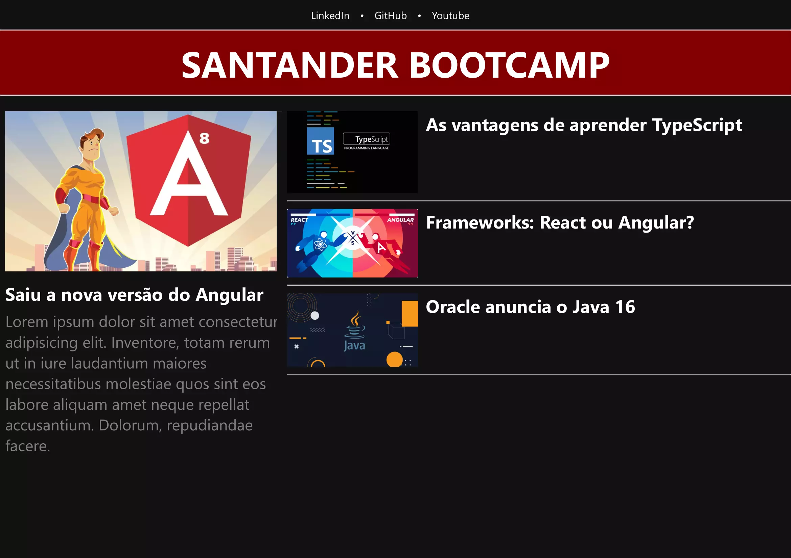
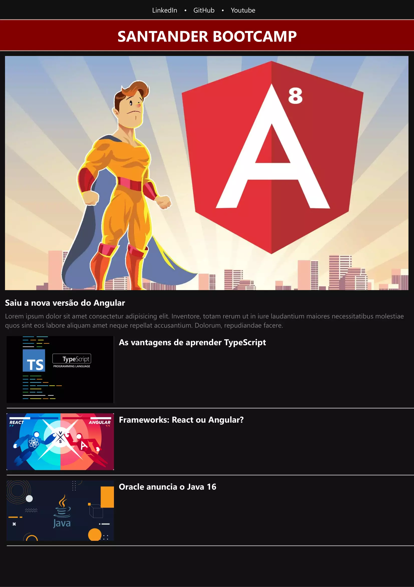

# AngularBlog 
### Santander bootcamp - DIO

Este projeto foi criado juntamente com o professor fera <a href="https://https://github.com/felipeAguiarCode">Felipe Aguiar</a>, utilizando o TypeScript e Angular.

